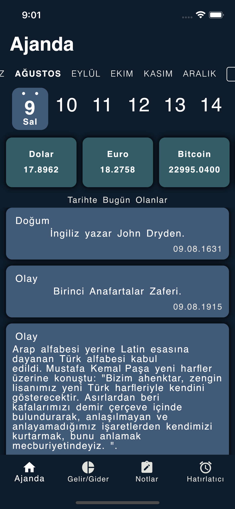
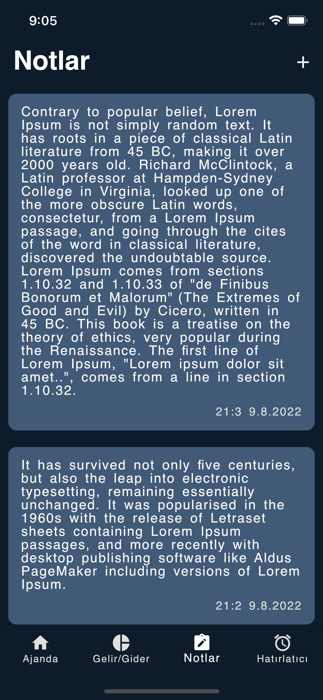
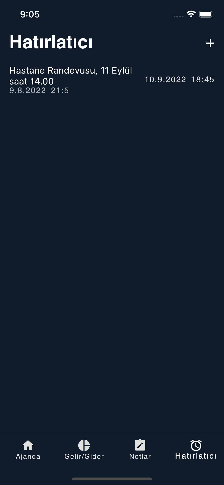
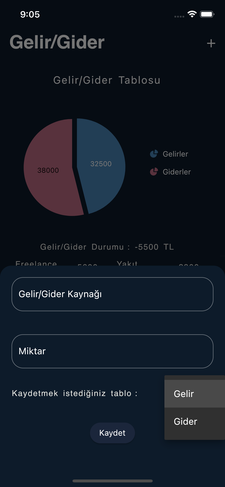
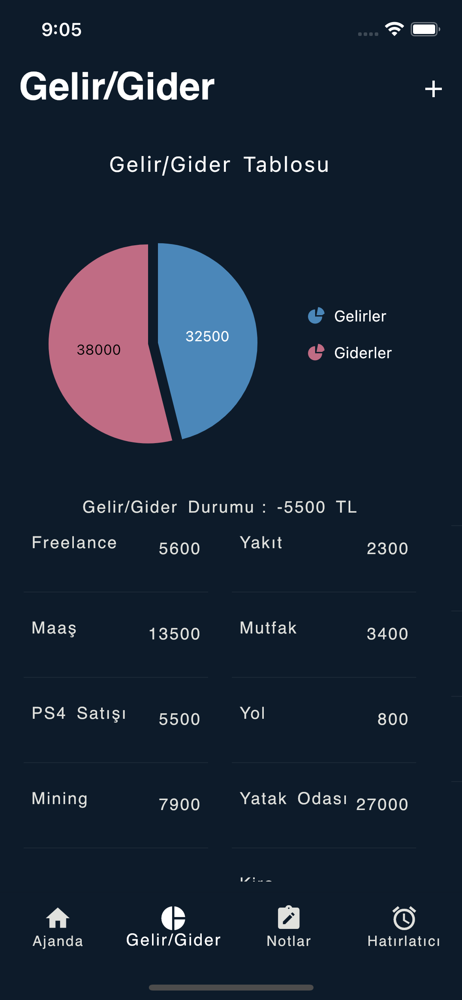
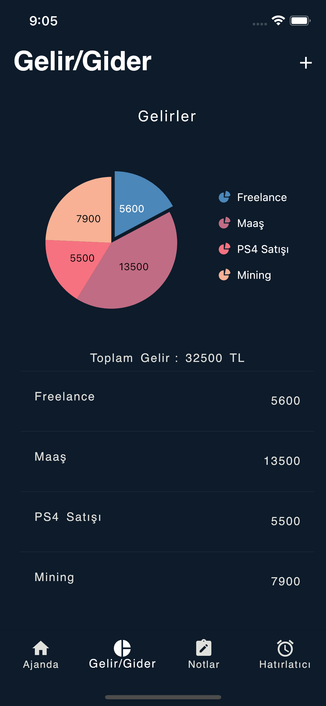
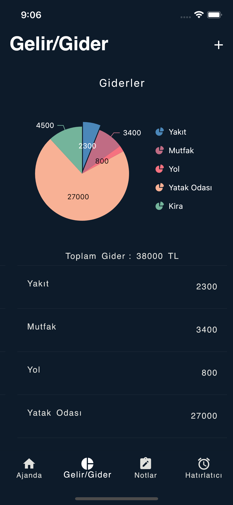

# agenda_app_with_flutter

Projeyi gündenlik hayatta kullandığımız ajandalardan esinlenerek yaptım. 
API'lardan veri çekerek günlük döviz kuru bilgisini ve tarihte bugün Api(https://api.ubilisim.com/tarihtebugun/) 'yi kullanarak günlük tarih 
verisini aldım. Bu veriyi Hive ile sakladım ve günde sadece bir kez istek
atacak şekilde ayarladım. Döviz kurlarında bunu yapmadım çünkü günlük 
değişimin gözlemlenmesi gerekiyor.

Aynı bir ajanda gibi not alabileceğimiz bir alan

Ve bir de hatırlatıcı sayfamız bulunmakta.

Bu ikisinin haricinde ufak çaplı bir gelir-gider tablosu
ekleyerek basit bir cüzdan uygulaması işlevi kazandırdım.

Bu verilerin hepsini Hive kullanarak sakladım.

